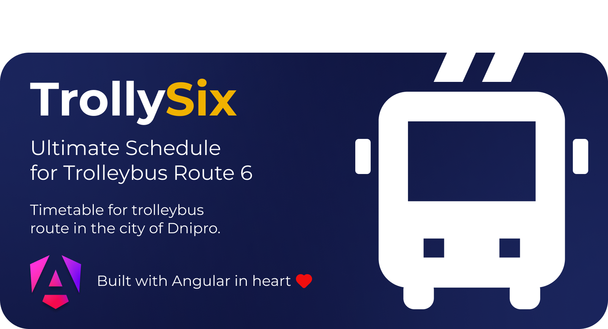

# TrollySix 




## Live

[🔗 Try it on trolly6.com](https://trolly6.com)

## 📦 Run frontend locally

```bash
git clone https://github.com/raindrop-ua/trollysix-client.git
cd trollysix-client
pnpm install
ng serve
```

---

Made with ❤️ by [Anton Sizov](https://antonsizov.com)
